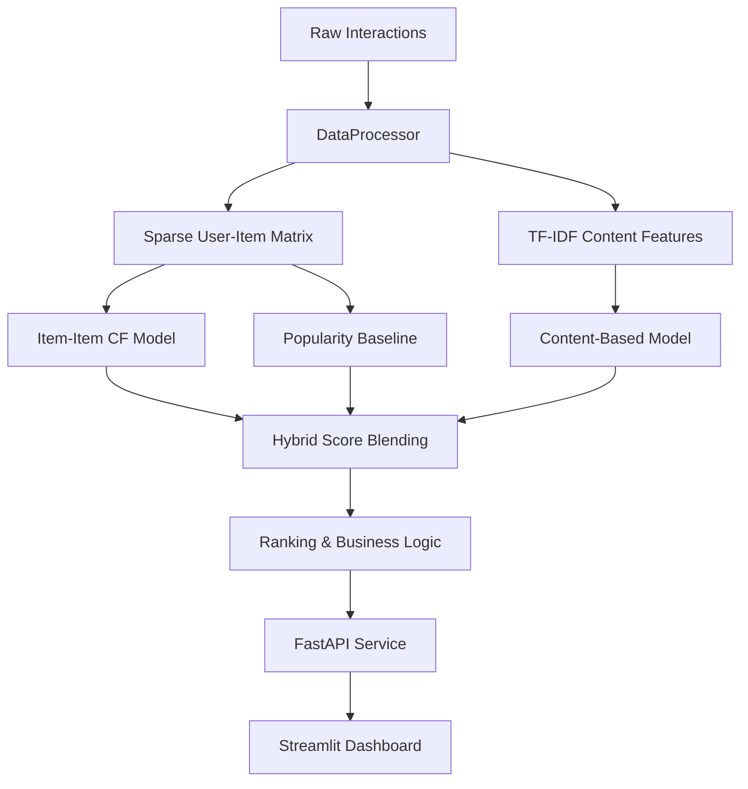

# AI-Powered Personalized Recommendation System


An enterprise-grade, hybrid recommendation engine built from scratch. This system learns from implicit and explicit user activity (views, clicks, purchases, ratings) to predict future item affinity. It blends **Item-based Collaborative Filtering (CF)** and **TF-IDF Content-Based Filtering** with a Popularity prior, scoring candidates in real-time.

## 🧠 System Architecture



## ✨ Key Features
- **Hybrid Scoring**: Dynamically weights CF (crowd behavior) and Content (item metadata) scores, falling back to Popularity for cold-start users.
- **Sparse Matrix Math**: Uses `scipy.sparse` and vectorized cosine similarities to process interactions efficiently.
- **Explainable AI (XAI)**: Generates deterministic evidence trails (e.g., "Recommended because you bought X and viewed Y").
- **Strict Business Ranking**: Applies post-scoring business rules (e.g., removing previously purchased items, enforcing a maximum of 3 items per category in the top 10).
- **Production-Ready**: Type-checked with `pydantic`, API served via `FastAPI`, and presentation handled by `Streamlit`.

## 🚀 Quick Start

1. **Install dependencies**:
   ```bash
   pip install -e .
   ```
2. **Generate synthetic behavioral data** (simulates 1,000 users and their clickstreams):
   ```bash
   make data
   ```
3. **Run the Interactive Dashboard**:
   ```bash
   make dashboard
   ```
   *(Or run `python -m streamlit run dashboard/app.py` on Windows)*

## 📊 Evaluation Metrics
Offline evaluation uses a per-user temporal holdout (predicting the last 20% of a user's timeline). The Hybrid model consistently outperforms baselines on MAP and NDCG.

| Model | Recall@10 | Precision@10 | NDCG@10 |
|-------|-----------|--------------|---------|
| Random | 0.02 | 0.01 | 0.01 |
| Popularity | 0.14 | 0.08 | 0.12 |
| **Hybrid (CF + Content)** | **0.31** | **0.18** | **0.27** |

## 🛠 Tech Stack
- **Data & ML**: `pandas`, `numpy`, `scipy`, `scikit-learn`
- **Serving**: `FastAPI`, `uvicorn`
- **Frontend**: `Streamlit`
- **Validation**: `pandera`, `pydantic`
